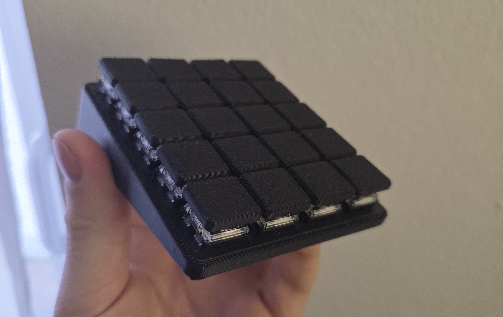
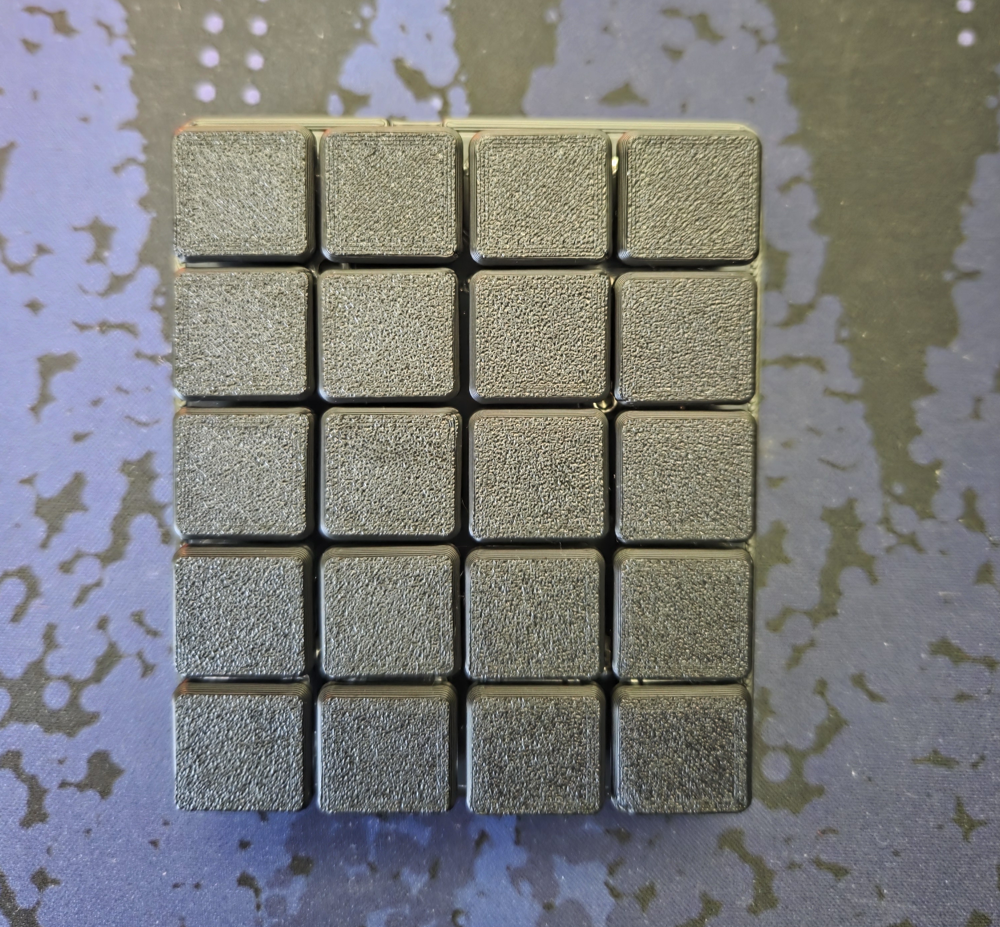
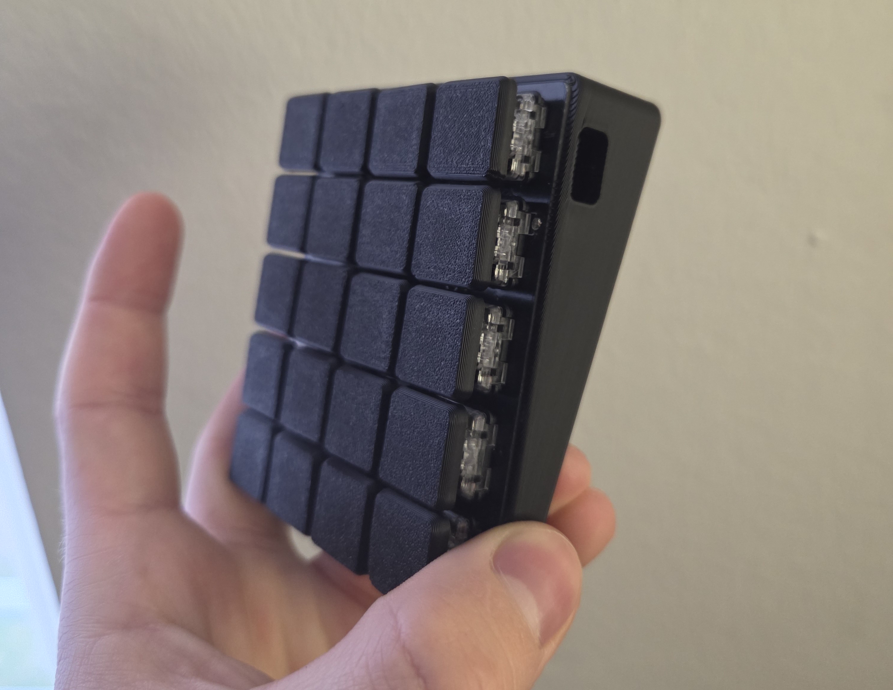

# Freezepad

This repository contains all files and configuration for the **Freezepad**, a custom wireless 20-key (5×4) low-profile macropad built completely from scratch. The goal was to create the smallest possible macropad footprint — achieved by placing the Nice!Nano v2 controller directly below the switches and eliminating diodes entirely. It runs ZMK firmware and is housed in a custom 3D printed case.

## Table of Contents

- [Hardware Components](#hardware-components)
- [PCB](#pcb)
- [Firmware (ZMK)](#firmware-zmk)
- [3D Printed Case](#3d-printed-case)
- [Build Notes](#build-notes)

---

## Hardware Components

| Component | Item | Notes |
| :--- | :--- | :--- |
| **PCB** | Custom Freezepad PCB | Ordered from JLCPCB. Files in `/pcb/`. |
| **Small Electronics** | 1x Push Button 6x2mm, 20x Kailh Choc V1 Hotswap Sockets, 1x Battery Switch | Ordered from AliExpress. |
| **Small Case Parts** | 3x M3 Heat Insert, 3x M3 Screw | For securing the PCB to the case. |
| **Controller** | 1x Nice!Nano v2 (or compatible) | Wireless connectivity via Bluetooth. |
| **Battery** | 1x 102050 LiPo (1000mAh) | Fits in the custom case. |
| **Switches** | 20x Kailh Choc V1 | e.g., Sunset, Robins. |
| **Keycaps** | 20x Choc V1 Keycaps | e.g., MBK Blank Choc Keycaps. |
| **Case** | Custom 3D Printed Case | Files are located in the `/case` directory. |

---

## PCB

The custom PCB was designed using Ergogen. The files are located in the `/pcb/` directory.

---

## Firmware (ZMK)

The Freezepad runs on [ZMK Firmware](https://zmk.dev/docs), designed for wireless keyboards and macropads.

### Configuration

* **ZMK Config:** The main configuration files are located in the `/config/` directory.

### Configure, Build & Flash

* **Configuration:** Use the [Keymap Editor](https://nickcoutsos.github.io/keymap-editor/)
* **Build:** Standard GitHub Actions (see `build.yaml`)
* **Flash:** Consult the [Nice!Nano documentation](https://nicekeyboards.com/docs/nice-nano/)

---

## 3D Printed Case

A custom case designed in Fusion360. Source and STEP files are provided in `/case`.

### Recommended Print Settings

* **Material:** ABS / ASA / PETG preferred for better heat resistance
* **Outer Walls:** Minimum of 3
* **Layer Height:** 0.2mm
* **Infill:** 15–20%
* **Supports:** Not required

---

## Build Notes
* **ControllerPlacement:** The Controller sits under the switches. Ensure that you trim the soldered Pins flush, otherwise swtiches will not plug in flush.
* **Battery Switch:** The battery switch is mounted on the PCB and accessible from the side of the case.
